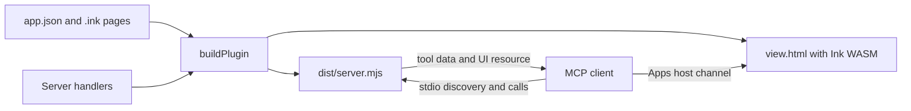

# What is AIUI MCPKit?

English | [简体中文](overview.zh-CN.md) · [Documentation index](../README.md)

MCPKit packages an AIUI Agent as a local MCP server and an interactive MCP Apps View. Start here if you have never written an Agent or connected an MCP tool.

## What you will build

Imagine asking an AI assistant to calculate an order quote. A text-only tool returns a total. With MCPKit, the same tool can return a total and open a page with quantities, a calculate button, loading state and cancellation. The AI can use the structured result, while the user can operate the page.

The repository includes Counter, Countdown and a deterministic business demo. The business demo uses example data and places no orders.

## Vocabulary

| Term | Meaning in this project |
| --- | --- |
| AIUI Agent | Your app source: `app.json`, `.ink` pages and their assets. |
| Ink | The runtime that executes your page logic and renders its UI. The generated View embeds the real WebAssembly runtime. |
| MCP | The protocol a client uses to discover and call tools and read resources. |
| MCP client / host | The application that starts the server and, if it supports Apps, displays its UI. |
| MCP tool | A named operation with a description and JSON Schema input. A page opener displays a page; a business tool also runs server logic. |
| MCP resource | Content read by URI. MCPKit supplies HTML UI resources using `ui://` URIs. |
| MCP Apps View | The host's iframe containing the HTML and Ink runtime. This is where your UI runs. |
| stdio | Communication over a local process's standard input/output. No HTTP port or website deployment is required. |
| Plugin / marketplace | The generated plugin directory and local installation catalog used by Codex. Other clients can register the server directly. |
| JSON Schema | A machine-readable declaration of accepted fields, types and constraints. It validates input and business output. |
| Handler | A server-side function implementing a business tool. |

## From source to interaction



1. You write a page and optionally its input/output schema.
2. `buildPlugin()` discovers registered pages, generates tool types, bundles the server and embeds UI assets/runtime.
3. The client starts `dist/server.mjs` and discovers tools.
4. A call validates arguments. Business tools execute a handler and validate its output.
5. An Apps-capable host reads the linked HTML resource and delivers input/result to the page.
6. The page updates its state, displays a result, and can request further tools through the host.

## Choose your learning path

- **First-time user:** [Install prerequisites](installation.md), [run the examples](quickstart.md), then [create your first Agent](first-agent.md).
- **UI developer:** Learn [page tools](../guides/page-tools.md), then [business tools](../guides/business-tools.md) and [request lifecycle](../guides/tool-lifecycle.md).
- **Build-tool developer:** Start with the [ESM integration](../guides/esm-build.md) and [build API reference](../reference/build-api.md).
- **Connecting a client:** Read [client setup](../guides/clients.md) and the [compatibility boundaries](../reference/compatibility.md).

## What to expect today

The generated server needs Node.js 22+. Its bundled output needs no separate npm install. The client must support MCP Apps to display UI and permit WebAssembly compilation. A client supporting only MCP can still discover/call tools and receive text or business data.

MCPKit currently generates local stdio servers. It does not generate an HTTP service, authentication layer, cloud deployment, `.mcpb` extension or `aix pack --target mcp-apps`. Text and binary assets are packaged; see [asset paths and CSP](../reference/build-api.md#binary-assets-and-csp). See [compatibility](../reference/compatibility.md) before selecting a host.

## Adapt to inline and fullscreen Views

A host can show a compact inline card or expand it to fullscreen. MCPKit maps these modes to Ink targets `_current` and `_blank`. Keep the primary result usable in inline mode, then reveal details or additional controls when fullscreen is available. A host may restrict the allowed modes, so fullscreen is not guaranteed.

Use a target media rule in your page's `<style>`; this fragment follows the [Counter source](../../examples/counter/pages/counter/index.ink):

```css
.details { display: none; }
@media (target: _blank) {
  .details { display: flex; }
}
```

Give the detail container `class="details"`. Host mode changes are forwarded to the runtime. Local browser tests verify mode restrictions and state continuity; the exact fullscreen controls and available space still depend on the desktop host.

---

[Documentation index](../README.md) · Next: [Prepare your environment](installation.md)
