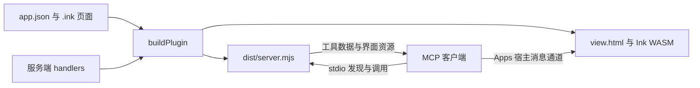

# 认识 AIUI MCPKit

[English](overview.md) | 简体中文 · [文档目录](../README.zh-CN.md)

MCPKit 把 AIUI Agent 打包成本地 MCP 服务和交互式 MCP Apps 界面。如果你第一次接触 Agent 或 MCP，先从这里开始。

## 最终能做出什么

假设你让 AI 助手计算订单报价。普通工具返回一个总价；使用 MCPKit，同一个工具可以同时返回总价并打开一个带数量、计算按钮、加载状态和取消按钮的页面。AI 使用结构化结果，用户直接操作页面。

仓库包含 Counter、Countdown 和固定数据的业务示例。业务示例用于学习，不会真的下单。

## 先认识几个名词

| 名词 | 在本项目中的含义 |
| --- | --- |
| AIUI Agent | 你编写的应用源码，包括 `app.json`、`.ink` 页面和资源。 |
| Ink | 执行页面逻辑、绘制界面的运行时。生成的界面内嵌真实 WebAssembly 运行时。 |
| MCP | 客户端发现工具、调用工具和读取资源时使用的协议。 |
| MCP 客户端 / 宿主 | 启动服务的应用；支持 Apps 时，还负责展示界面。 |
| MCP 工具 | 有名称、描述和 JSON Schema 输入定义的操作。页面工具打开页面；业务工具还会执行服务端逻辑。 |
| MCP 资源 | 通过 URI 读取的内容。MCPKit 用 `ui://` URI 提供 HTML 界面资源。 |
| MCP Apps View | 宿主内包含 HTML 和 Ink 运行时的 iframe，你的界面在这里运行。 |
| stdio | 通过本地进程的标准输入和输出通信，不需要 HTTP 端口或网站部署。 |
| 插件 / marketplace | Codex 使用的插件目录和本地安装目录索引。其他客户端可以直接注册服务。 |
| JSON Schema | 声明参数字段、类型和约束的格式，负责验证输入和业务输出。 |
| Handler | 在服务端实现业务工具的函数。 |

## 从源码到可操作界面



1. 编写页面，按需声明输入和输出 schema。
2. `buildPlugin()` 发现已注册页面，生成工具类型，打包服务端，内嵌界面资源和运行时。
3. 客户端启动 `dist/server.mjs`，发现有哪些工具。
4. 调用时验证参数；业务工具再执行 handler 并验证输出。
5. 支持 Apps 的宿主读取对应 HTML 资源，把输入和结果交给页面。
6. 页面更新状态、展示结果，也可以通过宿主再次调用工具。

## 按自己的目标开始

- **完全新手：** [准备环境](installation.zh-CN.md) → [运行示例](quickstart.zh-CN.md) → [创建第一个 Agent](first-agent.zh-CN.md)。
- **界面开发者：** 学习[页面工具](../guides/page-tools.zh-CN.md)，再读[业务工具](../guides/business-tools.zh-CN.md)和[请求生命周期](../guides/tool-lifecycle.zh-CN.md)。
- **构建工具开发者：** 阅读 [ESM 接入](../guides/esm-build.zh-CN.md)和[构建 API 参考](../reference/build-api.zh-CN.md)。
- **想接入自己的客户端：** 阅读[客户端接入](../guides/clients.zh-CN.md)和[兼容性边界](../reference/compatibility.zh-CN.md)。

## 当前能支持到什么程度

生成的服务需要 Node.js 22+，打包后的目录无需再次执行 npm 安装。显示界面需要客户端支持 MCP Apps 并允许编译 WebAssembly。仅支持 MCP 的客户端仍可发现和调用工具，得到文字或业务数据。

MCPKit 当前生成本地 stdio 服务，不生成 HTTP 服务、认证层、云部署、`.mcpb` 扩展或 `aix pack --target mcp-apps`。资源以文本方式打包，尚不支持二进制资源。选择宿主前请查看[兼容性](../reference/compatibility.zh-CN.md)。

## 适配内联和全屏界面

宿主可以展示紧凑的内联卡片，或展开为全屏。MCPKit 将两种模式映射到 Ink 的 `_current` 和 `_blank` 目标。内联时保证核心结果可用，支持全屏时再展示详情或更多操作。宿主可能限制允许的模式，因此不能假定一定有全屏。

在页面 `<style>` 中使用目标媒体规则，以下片段参考 [Counter 源码](../../examples/counter/pages/counter/index.ink)：

```css
.details { display: none; }
@media (target: _blank) {
  .details { display: flex; }
}
```

为详情容器设置 `class="details"`。宿主模式变化会转发给运行时。本地浏览器测试验证模式限制与状态连续性，具体全屏控件和可用空间仍由桌面宿主决定。

---

[文档目录](../README.zh-CN.md) · 下一篇：[准备环境](installation.zh-CN.md)
